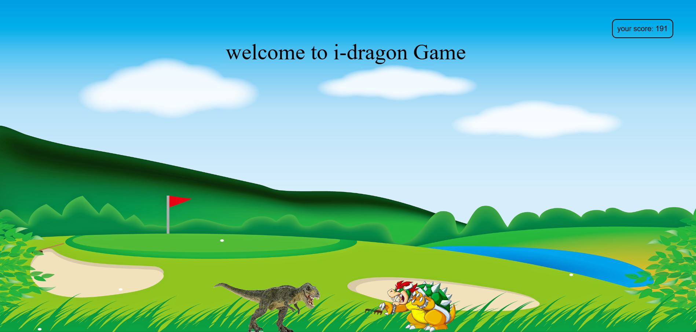

# 🦖 Dino Jump Game

A 2D web-based endless runner game where you control a dinosaur that jumps to avoid obstacles. 

---

## 🎯 Features

- 🕹️ Simple and addictive gameplay
- ⛰️ Randomly spawning obstacles 
- 🐾 Jump controls using spacebar or touch
- 🧠 Increasing difficulty over time
- 💻 Fully responsive and playable on desktop and mobile browsers
- 🔊 Optional sound effects and scoring system (if implemented)

---

## 🚀 Live Demo

🔗 [Play the Game] (Play on web browser)

---

## 🧰 Technologies Used

- **HTML5** – for rendering the game world
- **JavaScript** – core game logic, physics, and controls
- **CSS** – styling and layout

---

## 📂 Project Structure

/dino-jump-game/
├── index.html # Game UI
├── style.css # Game styles
├── script.js # Game logic
└── assets/ # Images and sounds

## 🕹️ How to Play

- **Up Arrow**  – Jump over the obstacles
- **right Arrow**  – To go ahead
- Avoid hitting obstacles to keep running
- Score increases the longer you survive!

---

## 📦 How to Run Locally

1. **Clone the repository** :
   git clone https://github.com/Subham62/Dino-Jump-Game.git

2. **Navigate to the folder** :
    cd dino-jump-game

3. **Open** index.html in your browser.

## 📸 Screenshots

|  |
